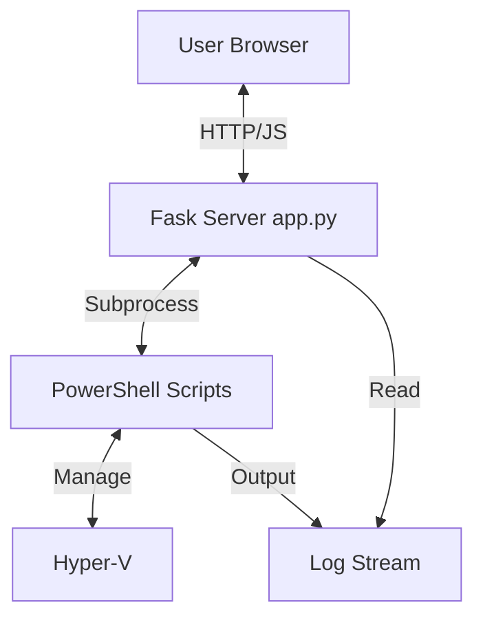

# Implementation Plan: Antigravity Driven Homelab

## 1. Context
We are building a web-based dashboard to manage local Hyper-V VMs.
- **Spec:** `.specify/spec.md`
- **Goal:** One-click provision/destroy of a lab environment with detailed logs.

## 2. Technology Stack
- **Backend:** Python 3.x with Flask.
    - Lightweight, easy to invoke shell commands.
- **Integration:** Python `subprocess` module to call PowerShell.
- **Frontend:** Vanilla HTML5, CSS3, JavaScript (ES6+).
    - No build steps.
    - **Aesthetics:** Antigravity Premium (Dark mode, neon accents, glassmorphism).
- **Database:** None / In-memory state allows (or simple JSON artifact if persistence needed across reboots).

## 3. Architecture

## 4. Proposed Files

### 4.1. Root Directory
- **[NEW] `README.md`**: Project documentation.
- **[NEW] `requirements.txt`**: Python dependencies (`Flask`, `flask-cors` if needed).
- **[NEW] `app.py`**: Main application entry point.
    - Routes: `/`, `/api/status`, `/api/provision`, `/api/destroy`, `/api/logs`.

### 4.2. Backend Scripts (`/scripts`)
*PowerShell scripts must be idempotent and return structured JSON where possible for status checks.*
- **[NEW] `scripts/Get-LabStatus.ps1`**
    - Checks specific VMs: "AG-Lab-Win", "AG-Lab-Linux".
    - Returns JSON: `[{ "name": "...", "status": "Running/Off", "ip": "..." }]`.
- **[NEW] `scripts/Provision-Lab.ps1`**
    - Takes params: VM Name, Type.
    - Creates VHDX (maybe diff disk from image), creates VM, connects Network.
- **[NEW] `scripts/Destroy-Lab.ps1`**
    - Stops and removes specific VMs. **Must check for existence first to ensure idempotency.**

### 4.3. Frontend (`/templates`, `/static`)
- **[NEW] `templates/index.html`**
    - Single Page Application structure.
- **[NEW] `static/style.css`**
    - Global variables for colors (Premium Palette).
    - Flex/Grid layouts.
    - Animations for "Spinning up".
- **[NEW] `static/app.js`**
    - Fetch API for backend communication.
    - Polling interval for Logs and Status.

## 5. Logic Flow

### 5.1. Initialization
- `app.py` starts.
- Homepage loads.
- JS calls `/api/status` to render current VM cards.

### 5.2. Provisioning
1. User clicks "Spin Up Lab".
2. JS POSTs to `/api/provision`.
3. Flask spawns `Provision-Lab.ps1` in a thread/subprocess.
4. Output is captured to a global thread-safe variable or list (LogBuffer).
5. JS polls `/api/logs` to update the "Console" window in UI.
6. Upon completion (success/fail), UI updates status.

### 5.3. Logs
- Simple in-memory list of strings in Python.
- `/api/logs` returns the latest lines.
- Cleared on new action start.

## 6. Verification Plan
### 6.1. Automated
- Write a simple Python test `tests/test_app.py` to mock subprocess and check API endpoints.
### 6.2. Manual
- Run `python app.py`.
- Open `http://localhost:5000`.
- Click "Spin Up".
- Verify Hyper-V Manager shows VMs appearing.
- Verify UI shows Logs.
